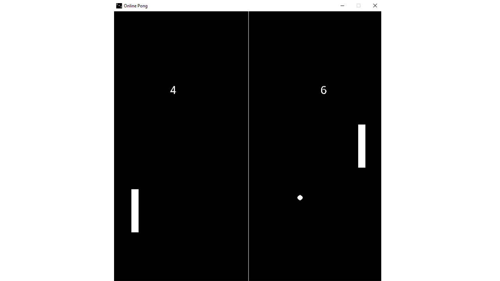

# Python Online Pong
An online pong game created using PyGame and sockets.

## How To Play
1. Make sure the PyGame library is installed (if not, `pip install pygame`)
2. Run server.py
3. In game_settings.py, make sure that HOST is referring to the correct server IP address (in case both players are from the same machine, no need to change any settings as the default server host is the same IP address as the client)
4. Run main.py for each player

## General Algorithm
The server holds both players, the ball and the game score (in order to keep the game synced between the two players as connection problems and lags can create different game states).
in each frame of the game, each client sends it's own player to the server for updating it's instance server-side and receives the opponent, the ball and the current score.  
NOTE: The server only sends the different game objects information while the rendering is taking place at the client-side.

### Workflow Diagram

